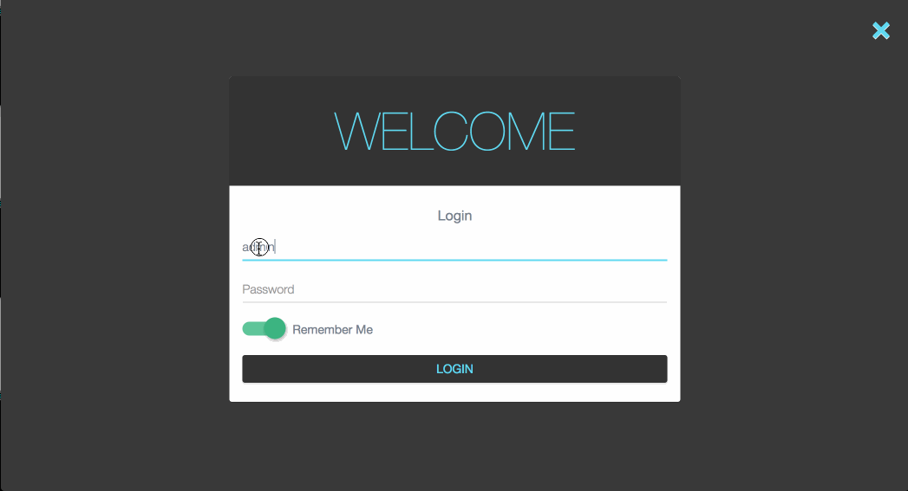

# HomelabOS

Your very own offline-first open-source data-center!

## [Documentation](https://nickbusey.gitlab.io/HomelabOS/)

## Summary

A set of Ansible scripts to configure a Docker based Homelab server with all sorts of goodies. Following the unix philosophy we gather together many specific tools to build the exact end result desired.

## Goals

To make it easy for anyone to own all their data in an easy and secure way, without the need of cloud providers.

## Features

* One command depyloment
* Automated Backups
* Easy Restore

### [Planned Features] (https://gitlab.com/NickBusey/HomelabOS/issues?label_name%5B%5D=enhancement)

## Demo

## Included Software

* [Convos](https://convos.by/) - Always-on IRC client (IRC bouncer)
* [Dashboard](https://github.com/causefx/Organizr) - Access all your HomelabOS services in one easy place.
* [Darksky](http://darksky.net/) - Local weather reported via [darksky-influxdb](https://github.com/ErwinSteffens/darksky-influxdb)
* [Dasher](https://github.com/maddox/dasher) - Amazon Dash button support
* [Documentation](https://nickbusey.gitlab.io/HomelabOS/) - Offline, searchable documentation via [MkDocs](https://www.mkdocs.org/)
* [Emby](https://emby.media/) - Media player
* [Firefly III](https://firefly-iii.org/) - Money management budgeting app
* [Gitea](https://gitea.io/en-US/) - Git hosting
* [Grafana](https://grafana.com/) - Pretty graphs
* [Home Assistant](https://www.home-assistant.io/) - Home Automation
* [InfluxDB](https://www.influxdata.com/time-series-platform/influxdb/) - Time series data storage
* [NextCloud](https://nextcloud.com/) - Private Cloud Storage, Calendar, Contacts, etc.
* [Paperless](https://github.com/danielquinn/paperless) - Document management
* [Portainer](https://www.portainer.io/) - Easy Docker management
* [Sonerezh](https://www.sonerezh.bzh/) - Music streaming and library management
* [Telegraf](https://www.influxdata.com/time-series-platform/telegraf/) - Server statistics reporting
* [Terminal](georgeyord/butterfly-web-terminal) - Web based terminal access
* [Transmission](https://transmissionbt.com/) - BitTorrent client

### Coming Soon

* BitWarden - Password manager
* BulletNotes - Note taking knowledgebase with kanban and calendar functionality.
* Chronograf
* Couchpotato
* FreshRSS
* Jackett
* NZBGet
* OwnTracksRecorder - https://github.com/owntracks/recorder
* [Pi-hole](https://pi-hole.net/) - Ad blocking
* Sonarr
* SynchThing
* urBackup

## Requirements

A server running Ubuntu 18.04 accessible via ssh with a user that has sudo.

A domain configured with a `A` type DNS record of `*.yourdomain.com` pointed at your server's IP address.

Ports 80 and 443 punched through any firewalls and port forwarded at your server in question.

Ansible version 2.5+ installed on your computer (not the server).

## [Installation](https://nickbusey.gitlab.io/HomelabOS/setup/installation/)

## Contributing

Please do!

### Working locally on the documentation

Follow the [MkDocs Material Theme setup directions](https://squidfunk.github.io/mkdocs-material/getting-started/).

Then run `mkdocs serve`.

To build changes to the docs run `make build`.